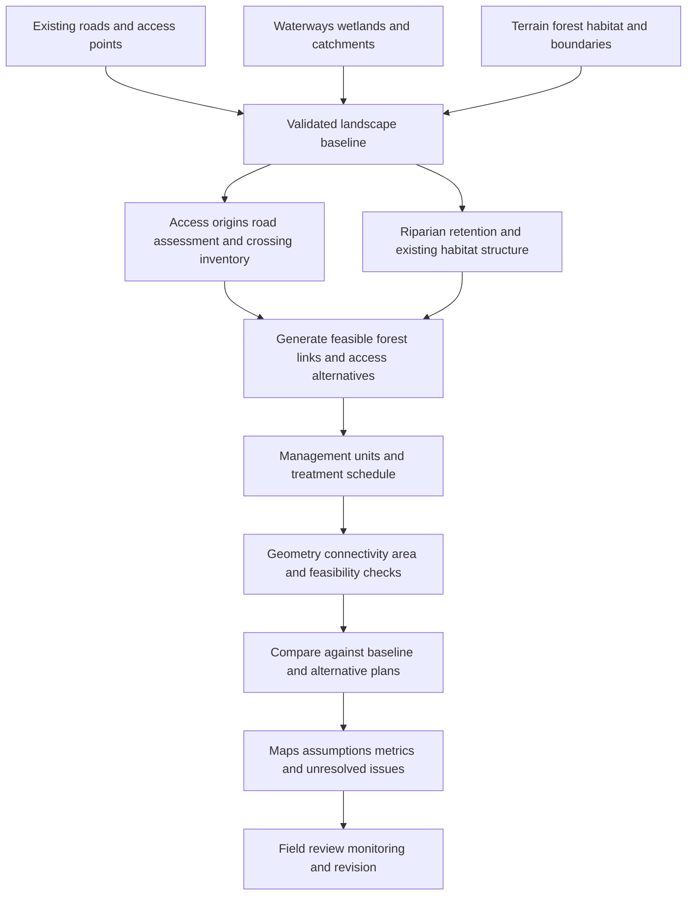

# DFM system map and implementation specification

Version: 0.1 — 13 September 2026

Status: approved direction from the project owner; proposed architecture, not a claim of implemented functionality. Supersedes generic patch-first or arbitrary-anchor descriptions as the target for future development. Original manuscripts and experimental implementations remain intact.

## Purpose

Design connected retained forest within managed landscapes by starting from existing roads, waterways, and habitat. Waterways establish riparian structure; roads establish access and disturbance context. Additional forest connections, management units, and treatment schedules develop around these mapped features.

Long-term forest continuity and conditions that may support old-growth development are objectives. Corridor geometry, reserve percentages, or a successful software run do not establish old-growth condition, genetic viability, or field performance.

## System boundaries and terminology

DFM is the overall forest-management framework. HDFM is the experimental computational framework. The website is the project explanation and documentation surface; it is not a working GIS planner.

Maintain separate representations of:

1. **Water network:** mapped waterways, water bodies, wetlands, drainage direction, and catchments.
2. **Access network:** existing road segments, junctions, entrances, crossings, and operational destinations.
3. **Retained habitat network:** forest polygons and candidate connections with habitat attributes. Road surfaces and open water do not count as retained forest.
4. **Management units:** treatment polygons and schedules compatible with retention and access requirements.

Features may be spatially adjacent or linked without being functionally interchangeable. Roadside retention can contribute habitat when supported by site and species evidence; proximity to a road alone does not establish habitat function. Road runoff connection to a stream is a risk attribute, not a desirable ecological edge.

Use multiple access roots when appropriate. Preserve real waterway topology, including branches, wetlands, and distributaries. Restrict acyclicity only to explicitly selected candidate subnetworks; do not force the union of all landscape features into one tree.

## System flow

## Required input contracts

Every dataset needs an ID, source, acquisition date, processing date, coordinate reference system, resolution or positional accuracy, license/use conditions, and uncertainty notes. Missing required inputs must be reported; a synthetic substitute must never silently appear as site evidence.

| Layer | Minimum attributes | Function |
|---|---|---|
| Planning boundary | stable ID, polygon, land area, management authority/context | Defines feasible extent and reported denominators |
| Waterways | stable segment ID, geometry, connectivity, flow direction if known, permanence/class, source confidence | Establishes riparian starting structure |
| Wetlands and water bodies | stable ID, geometry, type, uncertainty | Protection and habitat context beyond stream centerlines |
| Roads | stable segment ID, geometry, surface/width when known, access status, junction IDs, condition, allowed uses | Existing access and disturbance footprint |
| Access origins | ID, location, linked road segment, usable status | Explicit roots for proposed access |
| Crossings | ID, linked road and waterway IDs, location, type, condition, known passage/barrier attributes | Identifies interactions requiring assessment |
| Terrain | elevation raster, resolution, vertical units and datum | Supports derived slope, drainage, routing feasibility |
| Existing forest and stands | polygon ID, forest type, condition/age if known, canopy and habitat attributes | Identifies retained forest and treatment opportunities |
| Habitat objectives | focal species/guild or habitat objective, source, required destinations, model assumptions | Gives each proposed connection a purpose |
| Constraints | geometry, exclusion or conditional-use rule, provenance, applicable period | Enforces site-specific restrictions |
| Management objectives | treatment targets, planning periods, budget, access needs, retention policy | Makes alternatives comparable |

Supplementary inputs may include soils, erosion risk, climate scenarios, ownership subdivisions, cultural features with appropriate access controls, and monitoring observations. Sensitive exact locations belong in restricted project data, not on the explanatory website.

## Geometry and units

- Normalize working geometry into a suitable projected coordinate system. Check transformation validity and units before distance or area calculations.
- Internally use meters for length/width and square meters for area. Convert hectares explicitly at input/output boundaries using 1 hectare = 10,000 m².
- Distinguish forest area, planning land area, total polygon area, water area, and operational footprint. Name each denominator in outputs.
- Form corridor polygons from routed geometry; union overlaps, clip to authorized boundaries, and account for road/water exclusions when reporting retained forest area.
- Preserve original data and record transformations. Snapping and network connection tolerances must be explicit in meters and justified by input accuracy.
- Geometric intersection does not automatically mean a usable crossing or connected habitat. Check the relevant feature types and crossing attributes.

## Component map

Names below are proposed module responsibilities, not existing imports.

| Proposed component | Responsibility | Current starting point / gap |
|---|---|---|
| `baseline` | Input validation, coordinate transformations, provenance and typed layers | HDFM `Landscape` currently holds patch coordinates and complete Euclidean links |
| `water_network` | Preserve mapped topology, identify riparian structure and catchment relationships | No explicit implementation |
| `access_network` | Road/junction graph, access roots, crossing inventory, reuse/retirement alternatives | Raster prototype currently accepts generic anchor points |
| `retention` | Existing retained habitat, riparian polygons, candidate upland links | Existing width/entropy tools need corrected objectives and spatial integration |
| `routing` | Feasible paths over terrain with exclusions and crossing rules | Raster Dijkstra provides an experimental starting point; geofence handling needs correction |
| `planning` | Alternative generation, treatment units, schedule, joint access/habitat tradeoffs | Temporal optimizer is experimental; current uniform climate factor is insufficient |
| `validation` | Independent geometry, feasibility, metrics, and consistency checks | Existing tests cover limited synthetic properties and have identified failures |
| `reporting` | Reproducible maps, metrics, assumptions, diagnostics, and audit records | Existing plots and JSON outputs can inform this layer |

Do not copy the older local HDFM export over the newer GitHub version. First establish a versioned development checkout from the current repository and port only deliberate changes. Keep the local raster prototype identifiable until its role is decided.

## Generation and decision rules

1. Validate the baseline. Report disconnected or uncertain mapped features, missing inputs, and incompatible units.
2. Establish riparian retention from waterways and existing vegetation using justified site-specific rules. Establish access roots from usable mapped roads. Identify existing forest connections and crossing conflicts.
3. Generate candidate habitat links and access alternatives separately. Preserve each proposal's source feature IDs and objective IDs. Permit reuse, restoration, additional connections, or no intervention as alternatives.
4. Enforce spatial exclusions during routing. Evaluate full corridor footprints, not just centerlines. Treat proposed crossings explicitly.
5. Evaluate habitat function, access, and water-related risks with separate metrics. An entropy score must not substitute for successful movement or genetic viability.
6. Delineate management units and schedules around retention and feasible access. Revisit candidates if treatment requirements conflict with continuity.
7. Compare the status quo with DFM alternatives under equivalent targets, constraints, and engineering assumptions. If several measures change together, label the comparison as a management package.
8. Return a valid design or an explicit incomplete/infeasible status. Do not report failed optimization as a usable plan.

Widths, reserve fractions, branching angles, and maximum grades are configurable site parameters with provenance. The existing 20–30% reserve target and 100–200 m width rules are working hypotheses/defaults from project materials, not universal standards. They must not override site requirements or independent habitat evidence.

## Minimum outputs

| Output | Required content |
|---|---|
| Baseline and alternatives | Separate road, waterway, riparian retention, forest connection, crossing, and management-unit layers |
| Proposed GeoPackage | Stable feature IDs, units, CRS, geometry, source links, design purpose, status |
| Proposed JSON run manifest | Run ID, software revision, input checksums, parameters, seeds, solver status, validation results, timestamps |
| Metric report | Actual retained forest area, new/restored area, access length by action, crossings, habitat metrics and assumptions, violations |
| Schedule | Treatment period, unit IDs, retained connections, access dependencies, unresolved conflicts |
| Human review report | Side-by-side alternatives, uncertainty, excluded interpretations, next field checks |

Do not label proposed metrics as measured without observations. Report geometry checks, model outputs, and field measurements as different evidence types.

## Acceptance gates

- **Foundation:** every access root links to a mapped access feature; every generated connection has a documented habitat or management purpose and source feature references.
- **Input sensitivity:** moving or removing a relevant road entrance or waterway changes the affected design, its rationale, or its feasibility; no synthetic anchors silently replace it.
- **Geometry:** no unexplained outside-boundary or forbidden-footprint intersections; overlaps counted once; every returned edge has matching geometry and attributes.
- **Units:** known hand-calculated meter/hectare examples pass. Area never exceeds its valid reporting domain because of overlap or unit confusion.
- **Solver:** failed or infeasible results are explicit; final constraints checked independently; optimized widths included in the result.
- **Ecology:** zero movement success cannot win by eliminating conditional movement entropy. Population interpretation withheld until the estimator is corrected and independently validated.
- **Topology:** actual road and water networks preserved; permitted loops and multiple roots handled; hierarchy has a declared physical/functional basis.
- **Comparison:** treatment, budget, retained area, and engineering differences are controlled or explicitly disclosed.
- **Reproducibility:** the same inputs, revision, and seed reproduce the same design and metrics within documented tolerances.

## Delivery phases

1. **Project explanation — this update:** system specification, website, evidence boundaries, and source links.
2. **Corrected research core:** fix reviewed calculation and output defects; replace unsupported guarantees with deterministic checks.
3. **Road/water baseline:** load one actual site's typed layers, preserve topology and provenance, produce a baseline map and diagnostics.
4. **Integrated alternatives:** route retained forest and access candidates, produce polygons, compare against the baseline with equivalent requirements.
5. **Independent and field assessment:** ecological model review, site review, monitoring, and revision. Operational readiness depends on these results.

## Website contract

Audience: conservation planners, forestry practitioners, researchers, and potential project collaborators.

Primary journey: understand the foundation, follow the proposed system, see the research questions, inspect the software stage, and access the repository/specification.

The first release is a single-page explanatory website. It has no map upload, account system, optimizer execution, database, payment flow, or contact form. Those require a separate product scope and must not be implied by the presentation.

Required content: foundation; conceptual system map; generation sequence; research questions; current implementation limits; development path; project attribution; source and license links; downloadable specification.

Visual direction: restrained forest-green editorial design, clear water/road distinctions, readable typography, functional system diagram, and existing project artwork. Label the diagram conceptual; do not present it as a field site.

Content controls: no unsupported universal optimality claims, claimed field pilots, invented partners, guaranteed improvements, automatic genetic viability, or old-growth/carbon outcomes. Keep the original review documents as supporting records, not evidence of corrected code.

Publication: initial Sites deployment remains private to the owner. Public access, custom domain, audience changes, outreach, and uploaded field data are not part of this update.

## Source basis

- Owner clarification in this task: the system should stem from roads and waterways.
- Local DFM monograph sections 4.2–4.5 and road-network transformation discussion.
- Local DFM Planner manuscript, input layers and root-set formulation.
- Local DFM Software System, overarching retained-corridor purpose.
- `PROJECT_REVIEW_2026-09-13.md` and `FOUNDATIONS_REVIEW_2026-09-13.md` for observed implementation gaps.
- [USDA riparian forest buffer background](https://research.fs.usda.gov/centers/nac/riparianforestbuffers); background support, not DFM validation or endorsement.

## Mapping workspace implementation update

The website now includes `map.html` with Leaflet/Turf baseline mapping: separate typed layers, GeoJSON import/export, source inspection, optional OpenStreetMap background, approximate area/length measurements, and exploratory riparian buffers unioned and clipped to a planning boundary. This supersedes the earlier website-only/no-map scope above.

The initial dataset is explicitly fictional. Files are processed in the current browser tab and require export to preserve changes. No server upload, automated source acquisition, terrain routing, corridor optimizer, or ecological viability calculation was added. These remain the later implementation gates.

## Implemented service release — 2026-09-13

The website now includes owner-scoped persistent projects, revision conflict protection, source records, drawing and GeoJSON import, source-completeness checks, immutable geometric scenarios, comparison tables and map overlays, report export and full input snapshots. Roads and waterways are required for scenario creation. Forest retention is the intersection of the proposal and existing forest after road-surface and supplied open-water exclusions. Widths are assumptions, not policy prescriptions.

Current hosted stack: Leaflet + Turf frontend, separate Turf analysis module, Worker API, D1 storage. Independent Node/SQLite single-owner service and optional PostgreSQL adapter are included. PostGIS spatial processing, Python jobs, OpenLayers migration, automatic authoritative data ingestion, public signup, teams and billing are not implemented or activated. See website/README.md for deployment modes, verified checks and limits.
